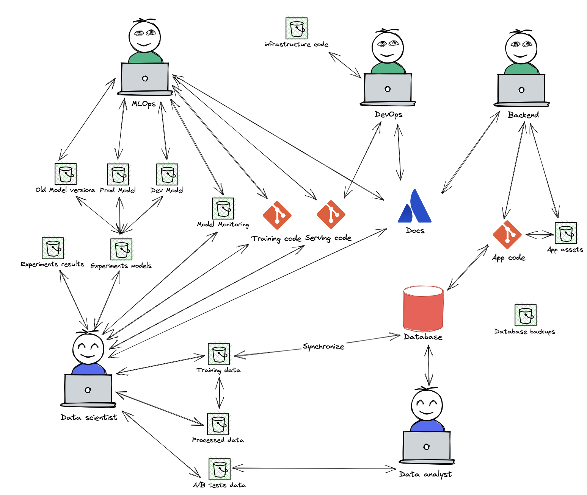
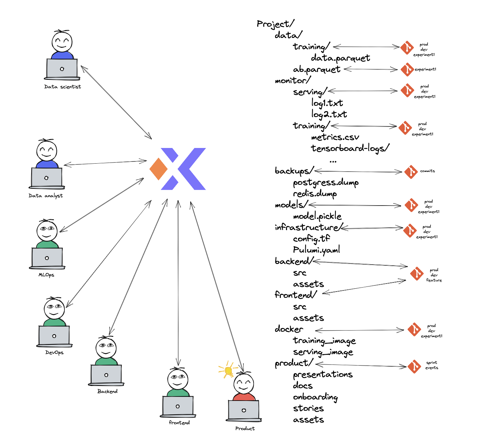

# Collaboration
One of the best aspects of Xet is the ability to collaborate with others.
We can use Xet to share data, models, and code.

A standard machine learning solution would be something like this:

   

   

Every team-member would have to know the location of all the relevant S3 buckets, and the credentials to access them.
Different versions of models would be saved in different files with many replicates, and dev and prod would be managed separately.        
Monitoring would probably be done in another bucket, and the data would be copied to a different bucket or database for analysis.      
Training data will be append-only, which means that every experiment would have to have another snapshot of the data somewhere for reproducibility.
Since serving code depands greatly on the model and technologiers, the data-scientist and mlops engineer would have friction.  

Can we do better?

   

   

